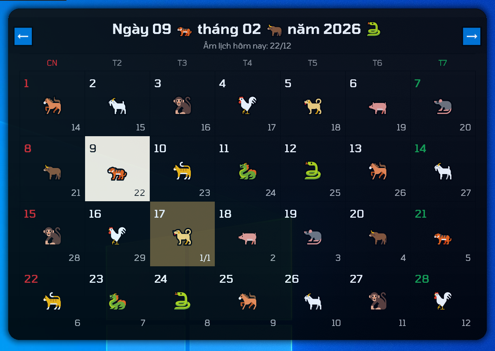

# VietCalendar - Vietnamese Lunar Calendar Desktop Widget

A lightweight Windows desktop widget that shows the Vietnamese lunar calendar alongside the solar date. It sits on your desktop, stays out of the way, and gives quick access to lunar day info, zodiac, and month navigation.

## Screenshot


## Features
- Always-on desktop widget with a clean, modern card UI
- Solar and lunar dates with Can Chi and zodiac emoji
- Fast month navigation and Go to Today
- Tray icon with quick actions and settings
- Optional Stick Desktop mode with hover-to-front behavior
- Custom colors, fonts, opacity, and scaling
- Multi-monitor aware with position memory
- Optional online check for today's lunar date

## Quick Start
1. Run `VietCalendar.exe`.
2. A small calendar card appears near the top-right of your screen.
3. Right-click the tray icon to open Settings or quick actions.

## Tutorial (First 2 Minutes)
1. Drag the widget to your preferred location.
2. Open tray menu and choose `Settings...`.
3. Set opacity, colors, and font size to match your desktop.
4. Toggle `Stick Desktop` if you want it to stay behind windows.
5. Use the header arrows or mouse wheel to browse months.

## Shortcuts and Controls
- Left-click header arrows: previous or next month
- Mouse wheel on header: previous or next month
- Shift + mouse wheel on header: previous or next year
- Double-click header: go to today
- Drag the card: move (when Move/Click Through is enabled)
- Right-click tray icon: open menu

## Tray Menu
- Settings...
- Previous Month
- Next Month
- Go to Today
- Reset position to top-right
- Stick Desktop toggle
- Primary Screen toggle
- Move/Click Through toggle
- Auto Run
- Exit

## Settings Overview
- Opacity slider
- Background color
- Text font and size
- Emoji font style (color or mono)
- Scale for solar, lunar, and emoji text
- Auto Run, Stick Desktop, Primary Screen only, Move/Click Through

## Configuration File
Settings are saved to:
`%APPDATA%\VietLunarCal\config.ini`

## Online Lunar Check
The widget can fetch today's lunar date from `https://www.xemlicham.com/` to cross-check accuracy. If offline, it falls back to local calculations.

## Build (Windows)
### MSVC (Developer Command Prompt)
```bat
cl /O2 /DUNICODE /D_UNICODE vietcalendar.c resource.rc /link user32.lib gdi32.lib comdlg32.lib shell32.lib wininet.lib d2d1.lib dwrite.lib advapi32.lib
```

### MinGW-w64
```bat
windres resource.rc -O coff -o resource.o
gcc -O2 -municode vietcalendar.c resource.o -o VietCalendar.exe -lcomdlg32 -lshell32 -lwininet -ld2d1 -ldwrite -lgdi32 -lole32 -luuid -luser32 -ladvapi32
```

### 32-bit (x86)
MSVC: use the "x86 Native Tools Command Prompt" and build as usual.

MinGW-w64: use a 32-bit toolchain and add `-m32`:
```bat
windres resource.rc -O coff -o resource.o
gcc -O2 -m32 -municode vietcalendar.c resource.o -o VietCalendar-32.exe -lcomdlg32 -lshell32 -lwininet -ld2d1 -ldwrite -lgdi32 -lole32 -luuid -luser32 -ladvapi32
```

If you see "skipping incompatible" or "cannot find" for Windows libraries, you are using a 64-bit toolchain.
Install a 32-bit MinGW-w64 toolchain and use its `gcc` (often `i686-w64-mingw32-gcc`), for example:
```bat
i686-w64-mingw32-windres resource.rc -O coff -o resource.o
i686-w64-mingw32-gcc -O2 -municode -mwindows vietcalendar.c resource.o -o VietCalendar-32.exe -lcomdlg32 -lshell32 -lwininet -ld2d1 -ldwrite -lgdi32 -lole32 -luuid -luser32 -ladvapi32
```

### Task Manager Note
The widget uses a tray icon and a tool window (no taskbar button), so it appears under **Background processes** and in the **Details** tab instead of the **Apps** list. This is expected.

## Notes
- The widget is DPI-aware and scales on high-DPI displays.
- If the widget becomes unclickable, toggle `Move/Click Through` from the tray menu.

## License
GPL-3.0. See `LICENSE`.
